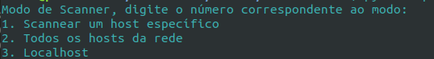
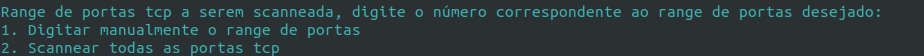
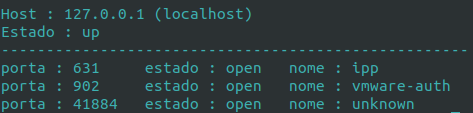

# Scanneador de portas

### Bruna mayumi Kimura

----------------------------

Este projeto consiste em scannear as portas de uma máquina ou rede. O código foi feito inteiramente em python, utilizando a biblioteca nmap. O site que inspirou esse trabalho foi o https://xael.org/pages/python-nmap-en.html.

## Modo de Uso:

### Instalação
É necessário instalar o nmap na sua máquina. 

É possível instalar com o pip:

`pip install python-nmap`

Ou usando apt:

`apt install nmap`

### Executando o projeto

Para executar o projeto basta abrir terminal e digitar

`python3 ports_scanner.py`

A saida desse programa será:

Basta escolher o modo e digitar o número correspondente no terminal e confirmar com enter. Caso escolha a opção 1, você terá que escrever o IP do host que será scaneado. A opção 2 scaneará todas os hosts conectados na rede, para isso é necessário informar a subnet e a mascara da rede. Por fim, a opção 3 fará o scaneamento no seu próprio computador, ou seja, no localhost.

Assim a próxima pergunta a ser impressa será:

Da mesma forma, basta escolher e digitar o número correspondente no terminal e pressionar enter. A opção 1 pedirá de que porta a qual porta será feito o scanner. é possível colocar uma porta só para scanner ou colocar uma faixa (ex.: 0-6000). Já na opção 2 será feita o scanner em todas as possíveis portas, ou seja, 0-65535.

Por fim, o log final das portas scaneadas será:

